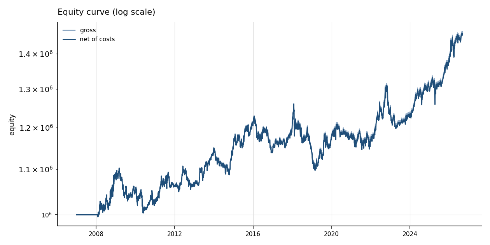
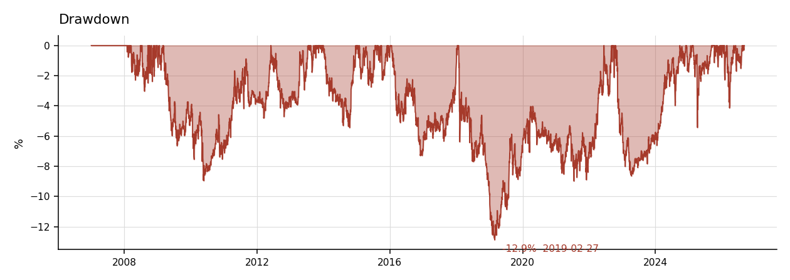
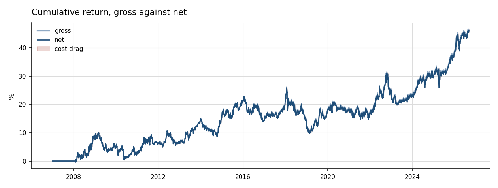
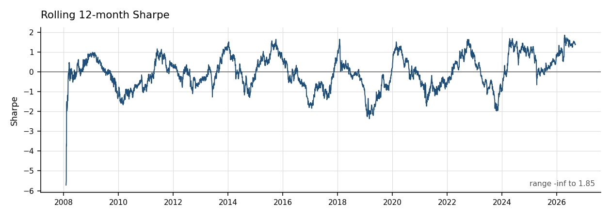
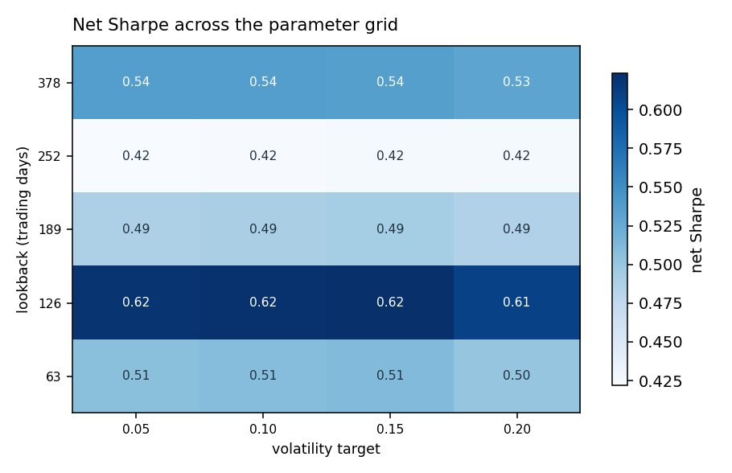

# tsmom-engine

An event-driven backtesting engine in C++20, built so that look-ahead bias is
structurally impossible rather than merely avoided by careful coding. A time-series
momentum strategy runs on top of it as a validation case.

---

## The design claim

Most backtests are vectorised: load the full price series into a dataframe, compute a
signal over it, shift by one, multiply by returns. It's fast to write, and it makes
look-ahead bias a matter of discipline. One misaligned shift and the results are
silently wrong in the direction that flatters them.

This engine takes the other approach. The strategy object is only ever *handed* data
timestamped at or before the current simulation time. There is no method anywhere on
the data handler that returns the full series — not for convenience, not for testing.
The strategy cannot see the future because it is never given the future.

That claim is enforced by [`tests/test_lookahead.cpp`](tests/test_lookahead.cpp), which
walks ten years of four staggered symbols and asserts, over roughly 1.6 million returned
bars, that none is dated after the current simulation time, that lookback windows are in
ascending order, and that the newest bar is the current date *exactly* — a silent lag
being as wrong as a lead, and only the lead direction is normally checked.

A test that passes proves nothing unless it can fail. Widening the cursor clamp by a
single bar makes it fail immediately, on the first bar of the run.

Two secondary properties follow from the same architecture:

- **Signal lag is physical, not conventional.** An order is never filled when it is
  submitted. It rests in the execution handler until the next market event for that
  symbol and fills at that bar's open. The handler holds no reference to the data
  handler at all, so there is no code path by which it *could* fill at the price that
  generated the signal.
- **Costs are charged on every unit of turnover**, and gross and net results are reported
  side by side so the cost drag is visible rather than buried in a summary statistic.

---

## Why C++

An event loop is inherently sequential — bar *N+1*'s processing depends on the state
after bar *N* — so there is nothing to vectorise and NumPy offers no help. This is a
genuine case where a compiled language earns its place, as distinct from research code
where the bottleneck is iteration speed rather than execution speed.

Rolling statistics update incrementally in O(1): Welford's algorithm for variance, EWMA
for volatility. No window is ever recomputed from scratch. The Welford implementation is
tested on `{1e9+4, 1e9+7, 1e9+13, 1e9+16}`, where the naive sum-of-squares formula loses
catastrophic precision and Welford recovers the variance of 30 to within 1e-9.

The peripheral scripts (data fetching, plotting) are Python, because that is the correct
place for the boundary.

---

## Architecture

```
                 ┌──────────────┐
                 │ DataHandler  │  bounded lookback only
                 └──────┬───────┘
                        │ MarketEvent
                        ▼
    ┌───────────────────────────────────────┐
    │            EventQueue                 │
    └───────────────────────────────────────┘
         │            │            │
    MarketEvent  SignalEvent  OrderEvent/FillEvent
         ▼            ▼            ▼
    ┌─────────┐  ┌──────────┐  ┌─────────────────┐
    │Strategy │  │Portfolio │  │ExecutionHandler │
    └─────────┘  └──────────┘  └─────────────────┘
```

The outer loop advances simulation time. The inner loop drains every event occurring
*at* that time before advancing, in two passes: first the market events and the fills
they release, then the signals raised once the whole universe is marked to market.

Strategies emit target weights; the portfolio owns sizing and order generation; the
execution handler owns fills and costs. Swapping in a more realistic cost model touches
one class.

Two interface decisions are load-bearing:

- **A strategy returns its signals rather than being handed the event queue.** A strategy
  with the queue could push a `FillEvent` and mark its own trades. Returning signals makes
  that impossible rather than merely bad manners.
- **A strategy never sees the portfolio.** It names a target weight; sizing, and whether a
  trade clears the deadband, belong to the portfolio. That keeps account size out of
  signal logic.

```
include/backtest/     engine, events, data handler, portfolio, execution, statistics, metrics
strategies/           buy-and-hold (validation), tsmom signal, sizing, tsmom
apps/                 backtest runner, parameter sweep, harness validation
tests/                102 tests, including the look-ahead test
analysis/             python plotting and independent validation
data/                 fetch script (CSVs are gitignored)
```

---

## Strategy

Time-series momentum, following Moskowitz, Ooi and Pedersen (2012). Long an asset if its
trailing 12-month return is positive, short if negative. Positions sized inversely to
each asset's EWMA volatility so each contributes equal risk, with a gross leverage cap.
Rebalanced monthly.

Universe: eight liquid ETFs spanning US and international equity, Treasuries, gold,
broad commodities and the dollar. Cross-asset diversity is what makes trend following
work; a basket of correlated equity ETFs is not diversification.

The strategy is arithmetically trivial — a mean, a sign and a division. It is here
because it has the strongest out-of-sample evidence of anything in the public
literature, which makes it a reasonable test of whether the engine produces sane
numbers. **The engine is the deliverable.**

---

## Build

Requires CMake ≥3.20 and a C++20 compiler. GoogleTest is fetched automatically.

```bash
cmake -B build -DCMAKE_BUILD_TYPE=Release
cmake --build build
ctest --test-dir build
```

Fetch data and run:

```bash
pip install yfinance pandas matplotlib
python data/fetch_data.py
./build/bin/run_backtest --config=config/default.toml
./build/bin/sweep --config=config/default.toml
python analysis/analyse.py
```

Any config key can be overridden on the command line: `--lookback=126`,
`--commission_bps=2`. An unknown key is an error rather than a warning, because a
silently ignored typo in a parameter name is a run that did not do what its config says.

The tests that need downloaded data skip rather than fail when it is absent, so a fresh
clone runs green.

---

## Validation

Before any strategy result is reported, the harness is checked against a case with a
known answer. Buy-and-hold SPY from 2007 is run through the full engine, and the same
figures are computed independently in [`analysis/validate.py`](analysis/validate.py) with
pandas — from the raw CSV, sharing no code with the engine, so an accounting bug shows up
as a disagreement rather than being copied into both sides.

| Metric | Engine | pandas | Difference |
|---|---|---|---|
| Annualised return | 0.1101949498 | 0.1101949498 | 0 |
| Annualised volatility | 0.1955929143 | 0.1955929143 | 0 |
| Sharpe | 0.5301683452 | 0.5301683452 | 8.9e-16 |
| Max drawdown | 0.5514074306 | 0.5514074306 | 0 |

The two equity paths agree to a maximum relative difference of **2.6e-16** over 4950
bars, against the 1e-6 the specification asks for. Sharpe of 0.53 sits in the expected
0.4–0.6 band, and the 55.1% drawdown troughs in March 2009 — the financial crisis is
visibly in the curve, at the right depth and on the right date.

An engine that cannot reproduce buy-and-hold cannot be trusted on anything harder.

---

## Results

Eight ETFs, 2007-01-03 to 2026-09-04, 4950 bars, 19.6 years, 237 monthly rebalances,
1693 fills. Costs 0.5bp commission and 0.5bp slippage per side — 2bp round trip,
deliberately pessimistic for liquid ETFs.

| Metric | Gross | Net |
|---|---|---|
| Annualised return | 1.97% | 1.95% |
| Annualised volatility | 4.82% | 4.83% |
| Sharpe (risk-free 2%) | 0.014 | 0.009 |
| Sharpe (no risk-free deduction) | 0.428 | **0.423** |
| Max drawdown | 12.80% | 12.87% |
| Drawdown duration | 1599 days | 1599 days |
| Skew | −0.193 | −0.193 |
| Excess kurtosis | 4.63 | 4.64 |
| Annualised turnover | | 259% |





### Two Sharpe figures, because neither is right alone

The engine credits no interest on idle cash, and at a mean gross exposure of 0.79 most
of the book *is* cash. Subtracting a 2% risk-free rate therefore charges the strategy for
a return it never earned, which gives 0.009. Charging nothing gives 0.423. The honest
figure is between the two and nearer 0.423.

Reporting only the higher number would have been convenient and wrong; reporting only the
lower one would understate the strategy by the same mistake in the other direction. Both
are printed, and a financing model is listed below as a limitation rather than quietly
assumed away.

### Volatility and drawdown are below the usual range, and that is the specification

The sizing rule is `weight_i = sign_i × (σ_target / σ_i) × (1/N)` with σ_target = 10%
*per position*. Across eight symbols that aims at roughly 10%/√8 ≈ 3.5% at portfolio
level, and 4.83% is realised — consistent once the positive correlation between trend
positions is allowed for. It is not the 8–15% a trend book usually runs at.

Levering up to reach that range would have moved volatility and drawdown into it without
improving the result by a single basis point, since Sharpe is scale-invariant. It would
only have made the table look more like the table, so it was not done.

### The drawdown that matters is the long one

The worst drawdown is 12.87%, which is mild. It lasted **1599 days** — four and a half
years underwater. Depth is what gets reported; duration is what ends real strategies, and
almost nobody reports it.



The rolling 12-month Sharpe spends long stretches well below the headline figure. A
single number for a 19-year sample hides how much of that sample it was nowhere near.

### Calendar-year returns

```
2008 +8.56%   2012 +0.53%   2016 -5.47%   2020 +1.17%   2024 +4.85%
2009 -3.50%   2013 +7.72%   2017 +5.90%   2021 -1.51%   2025 +6.34%
2010 -1.39%   2014 +0.26%   2018 -5.98%   2022 +7.20%
2011 +2.93%   2015 +4.89%   2019 +2.99%   2023 -1.09%
```

2008 and 2022 are the two years trend following is supposed to win, and it does. The
flat-to-negative 2009–2012 whipsaw and the mediocre 2010s are also what the literature
reports. That pattern is the main evidence the strategy is behaving like trend following
rather than like a bug.

---

## Robustness

Twenty runs across five lookbacks and four volatility targets. The whole grid is
reported, not its best cell: a sweep quoted at its maximum is a search presented as a
result.

Net Sharpe, risk-free deduction removed:

| Lookback | 0.05 | 0.10 | 0.15 | 0.20 | Turnover @0.10 |
|---|---|---|---|---|---|
| 63 | 0.507 | 0.509 | 0.511 | 0.502 | 546% |
| 126 | 0.619 | 0.621 | 0.623 | 0.609 | 353% |
| 189 | 0.488 | 0.490 | 0.493 | 0.486 | 304% |
| 252 | 0.422 | 0.423 | 0.424 | 0.424 | 259% |
| 378 | 0.537 | 0.536 | 0.536 | 0.531 | 253% |



**There is a plateau.** All five lookbacks are positive and span 0.42 to 0.62. Nothing
spikes: the best cell beats its neighbours by roughly 0.11 and 0.13, comfortably inside
what the standard error of a Sharpe estimate over 19.6 years admits (about 1/√19.6 ≈
0.23). The result does not depend on the lookback being right, which is the property
worth having.

The 252-day value the literature uses is the *worst* of the five. Picking 126 out of this
grid after the fact would be fitting; the honest reading is that the five are not
distinguishable at this sample length. The headline result above remains the 252-day
configuration, fixed before any of this was run.

Rows are nearly flat across volatility targets, as they must be — Sharpe is
scale-invariant and the target reaches the result only through costs, which is why the
0.20 column is very slightly worse. That is asserted as a code property in
[`tests/test_robustness.cpp`](tests/test_robustness.cpp) rather than left as an
observation.

[`NOTES.md`](NOTES.md) logs every parameter variation tried, and there have been 22 in
total: two forced by the build plan and the twenty cells of this grid. None was chosen to
improve the headline figure. The count matters — if a configuration eventually looks
good, the number of variations tried is what determines how much to discount it.

---

## Limitations

Stated plainly, because a backtest that doesn't declare what it omits isn't worth
reading.

- **No interest on cash.** The engine credits nothing on idle balances and charges nothing
  on negative ones. With the book 79% in cash on average this is the single largest
  modelling gap, and it is why two Sharpe figures are reported instead of one. Adding a
  financing model would also have meant rebuilding the reference implementation that
  currently validates the harness to 2.6e-16.
- **ETF proxies, not futures.** Real trend followers trade futures, which have different
  cost, margin and roll characteristics. The ETF universe is a convenience.
- **No borrow costs or shorting constraints.** Short positions are assumed freely
  available at no financing cost, which is false.
- **Flat basis-point cost assumption.** No market impact model, so results do not
  reflect what happens as position size grows relative to volume.
- **Single-path backtest.** No bootstrap or Monte Carlo confidence interval on the
  Sharpe ratio. Over 19.6 years the standard error of a Sharpe estimate is roughly 0.23,
  so the reported 0.42 is compatible with a fairly wide range of true values — including
  zero.
- **One sample, one regime history.** Trend following performed poorly from roughly
  2010–2019 and strongly in 2022. A backtest over this window contains both, but that is
  one path, not a distribution.
- **Adjusted prices throughout.** Dividends are reinvested into the price series rather
  than modelled as cash flows, which is standard but not the same thing.
- **No survivorship correction is needed here** (the ETF universe is fixed and
  long-lived), but this would be a material issue if the universe were extended to
  individual equities.

---

## Not a trading system

This is a research and engineering exercise. It is not investment advice, it has never
traded live, and the results should not be taken as evidence that the strategy would be
profitable after the frictions listed above. Anyone reading this as a reason to trade
should read the limitations section again.

---

## References

- Moskowitz, Ooi and Pedersen (2012), *Time Series Momentum*, Journal of Financial
  Economics.
- Welford (1962), *Note on a Method for Calculating Corrected Sums of Squares and
  Products*, Technometrics.

## Licence

MIT.
